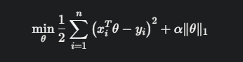
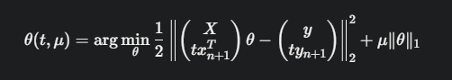
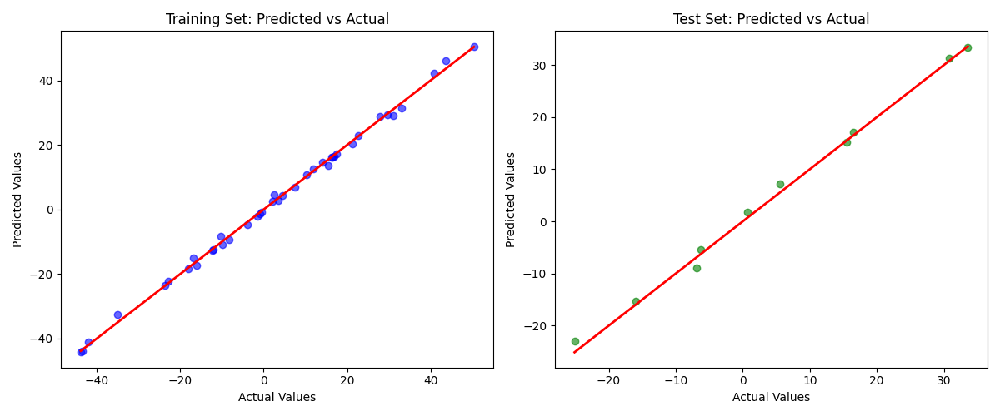
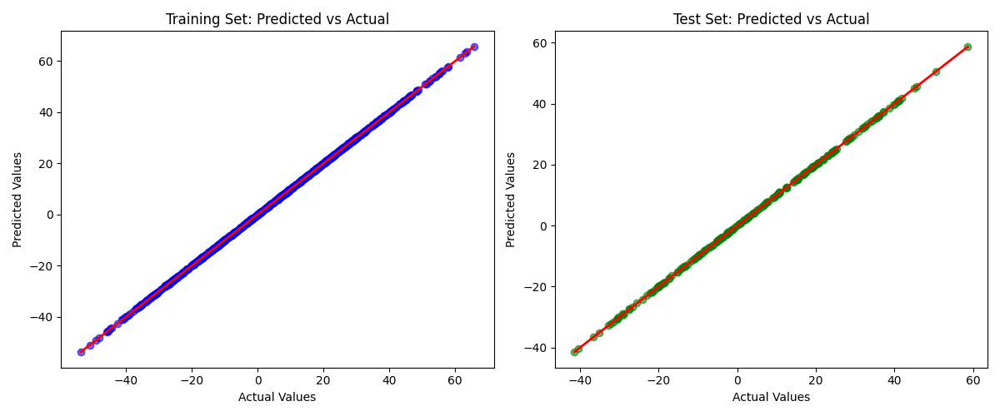
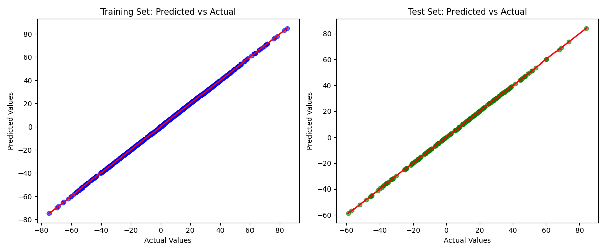

# Project 1 
--- 

# Lasso Regression

---

## Table of Contents

1. Introduction
2. Project Overview
3. Model Description
4. Running the Code
5. Testing the Model
6. Tunable Parameters
7. Potential Issues
8. Output and Visualizations
9. Question and Answers
10. Contributors
---

## Introduction
* This project focuses on the implementation of the LASSO (Least Absolute Shrinkage and Selection Operator) regression model, a powerful linear regression technique that incorporates L1 regularization to promote sparsity in the model coefficients. The LASSO method is particularly effective for feature selection, as it can shrink less important feature coefficients to zero, thereby producing a sparse and interpretable model. Our implementation leverages the Homotopy Method, a computational approach that efficiently computes the solution path of the LASSO model by tracing the changes in the active set of features as the regularization parameter evolves. Unlike traditional methods that rely on pre-existing libraries such as SciKit Learn, this project builds the LASSO model from first principles, offering a deeper understanding of its mechanics.

* The Homotopy Method, as detailed in the research paper "An Homotopy Algorithm for the Lasso with Online Observations" by Pierre J. Garrigues and Laurent El Ghaoui, allows for efficient updates to the LASSO solution when new data points are observed sequentially. This method computes a path from the current solution to the new solution by introducing an optimization problem that varies a parameter t from 0 to 1, effectively incorporating the new observation. Our implementation extends this concept to handle both static and sequential datasets, making it versatile for various applications such as feature selection, handling collinear data, and compressive sensing with sequential observations. The project also includes tools for cross-validation, performance evaluation, and visualization of the model's predictions, as demonstrated by the scatter plots of predicted versus actual values for training and test sets.

---

## Project Overview
* The primary objective of this project is to develop and test a LASSO regression model using the Homotopy Method, focusing on its ability to perform feature selection and handle linear regression problems with high-dimensional or collinear data. LASSO regression is particularly valuable in scenarios where the number of features exceeds the number of observations or when features are highly correlated, as it can automatically select a subset of the most relevant features by setting the coefficients of less important features to zero. This sparsity not only improves model interpretability but also reduces the risk of overfitting, making the model more robust for predictive tasks.

* Our implementation includes a comprehensive workflow for training and evaluating the LASSO model. The test_LassoHomotopy.py script loads a dataset, shuffles and normalizes the data, splits it into training and test sets, and uses k-fold cross-validation to select the optimal regularization parameter (alpha) that minimizes the Mean Squared Error (MSE). The model is then trained on the full training set using the optimal alpha, and its performance is evaluated on both the training and test sets. The project also provides visualizations, such as scatter plots of predicted versus actual values, to assess the model's fit. These plots, as shown in the example outputs for datasets like small_test.csv, test1.csv, and test2.csv, demonstrate the model's ability to closely align predicted values with actual values along the ideal line (y=x), indicating good predictive performance.

* The project is designed for use in scenarios requiring feature selection, such as in high-dimensional datasets where identifying the most influential variables is critical, or in applications like compressive sensing where sparse solutions are desirable. It is also well-suited for datasets with highly correlated features, as LASSO can effectively handle collinearity by selecting one feature from a group of correlated features while setting the others to zero. Additionally, the implementation supports sequential data processing, making it applicable to online learning scenarios where data arrives incrementally.

---

## Model Description
* The LASSO model implemented here is designed to handle linear regression problems where feature selection is crucial. It includes features like adaptive alpha adjustment and early stopping to improve convergence efficiency.



* Here, θ represents the model coefficients, xi and yi are the feature vectors and target values, respectively, and α is the regularization parameter that controls the trade-off between the least-squares error and the L1-norm penalty. The L1 penalty ( ∥θ∥1) encourages sparsity by driving some coefficients to exactly zero, effectively performing feature selection.

* Our implementation uses the Homotopy Method to solve this optimization problem efficiently. The Homotopy Method, as described in the research paper, computes the solution path by introducing a parameter t that transitions the problem from the current solution (with n observations) to the new solution (with n+1 observations). Specifically, the method solves an intermediate optimization problem:



* where t varies from 0 to 1,X and y are the current data matrix and target vector, and x n+1 and y n+1 ​are the new observation. At t=0, the solution corresponds to the current model, and at t=1, it incorporates the new observation. The method iteratively updates the active set (the set of non-zero coefficients) and their signs by identifying transition points where the active set changes, ensuring computational efficiency through rank-1 updates.

* The implementation includes several enhancements to improve performance and usability. It features adaptive alpha adjustment through cross-validation, which selects the optimal regularization parameter by minimizing the MSE across k folds. Additionally, the model incorporates early stopping to prevent unnecessary iterations once convergence is achieved, based on a specified tolerance (tol). The LassoHomotopy.py script encapsulates this functionality, providing a robust and efficient solver for LASSO regression that can handle both static datasets and sequential observations, making it suitable for a wide range of applications.

---

## Running the Code
To run the code in this project using VS Code, follow these steps:

#### Create a Virtual Environment:

Open the terminal in VS Code by navigating to View > Terminal or using the shortcut Ctrl + (backtick).

Use Python's venv module to create a virtual environment:

```bash
python -m venv venv
```

Activate the Virtual Environment:

On Windows:

```bash
venv\Scripts\activate
```

On macOS/Linux:

```bash
source venv/bin/activate
```

Install Required Packages:

Install packages from requirements.txt:

```bash
pip install -r requirements.txt
```
Run PyTest:

Navigate through the LassoHomotopy directory:
```bash
cd LassoHomotopy
```

Navigate to the tests directory:

```bash
cd tests
```

Run PyTest:

```bash
pytest pytest_testing.py
```

Run 

```bash 
test_LassoHomotopy.py
```

Navigate to the directory containing test_LassoHomotopy.py.
Run the script with a specific CSV file and parameters:

```bash
py test_LassoHomotopy.py small_test.csv --kcf 5 --max_iter 5000 --tol 1e-5
```

You can also run it with other datasets like
test1.csv: 

```bash
py test_LassoHomotopy.py test1.csv --kcf 5 --max_iter 5000 --tol 1e-5
```

test2.csv:

```bash
py test_LassoHomotopy.py test2.csv --kcf 5 --max_iter 5000 --tol 1e-5
```
---
## Testing the Model


### 11) Test Cases for the LASSO Regression Model

1. Test Case: Model Performance on small_test.csv with Default Parameters
* Description: This test evaluates the LASSO model's performance on the small_test.csv dataset using the default parameters specified in the script (kcf=5, max_iter=5000, tol=1e-5). The dataset is small, likely containing a limited number of samples and features, making it a good baseline for testing the model's basic functionality.
* Objective: Verify that the model can fit the training data and generalize to the test data, as shown in the scatter plots where predicted values closely align with actual values (range: -20 to 30).
* Expected Outcome: Low Mean Squared Error (MSE) on both training and test sets, with scatter plots showing points clustered around the y=x line, indicating good predictive performance.
---
2. Test Case: Model Performance on test1.csv with Default Parameters
* Description: This test assesses the model's performance on the test1.csv dataset, which appears to have a broader range of values (-40 to 50) compared to small_test.csv. The default parameters are used (kcf=5, max_iter=5000, tol=1e-5).
* Objective: Ensure the model can handle a dataset with a larger range of values and still produce accurate predictions, as evidenced by the scatter plots.
* Expected Outcome: The model should achieve low MSE on both training and test sets, with scatter plots showing tight clustering around the y=x line, confirming its ability to generalize across a wider range of data.
---
3. Test Case: Model Performance on test2.csv with Default Parameters
* Description: This test evaluates the model on the test2.csv dataset, which has the widest range of values (-60 to 80) among the provided datasets. The default parameters are used (kcf=5, max_iter=5000, tol=1e-5).
* Objective: Test the model's robustness on a dataset with high variability, ensuring it can maintain predictive accuracy.
* Expected Outcome: The scatter plots should show near-perfect alignment of points along the y=x line, with low MSE values, indicating excellent performance and generalization on a larger, more varied dataset.
---
4. Test Case: Cross-Validation for Optimal Alpha on small_test.csv
* Description: This test uses k-fold cross-validation (with kcf=5) to find the optimal regularization parameter (alpha) for the small_test.csv dataset. The script tests a range of alpha values (np.logspace(-4, 4, 20)) and selects the one that minimizes the MSE.
* Objective: Validate that the cross-validation process correctly identifies an alpha value that balances model complexity and predictive accuracy.
* Expected Outcome: The script should output an optimal alpha value and a corresponding MSE, with the final model (trained with this alpha) showing good performance on both training and test sets, as seen in the scatter plots.
---
5. Test Case: Cross-Validation for Optimal Alpha on test1.csv
* Description: Similar to the previous test, this case applies k-fold cross-validation (kcf=5) to the test1.csv dataset to determine the optimal alpha value.
* Objective: Ensure that the cross-validation process is effective for a dataset with a broader range of values, confirming the model's ability to adapt its regularization strength.
* Expected Outcome: An optimal alpha value should be identified, leading to low MSE on both training and test sets, with scatter plots showing tight clustering around the y=x line.
---
6. Test Case: Cross-Validation for Optimal Alpha on test2.csv
* Description: This test performs k-fold cross-validation (kcf=5) on the test2.csv dataset to find the optimal alpha value.
* Objective: Verify that the cross-validation process works well for a dataset with high variability, ensuring the model can select an appropriate alpha for optimal performance.
* Expected Outcome: The selected alpha should result in low MSE values, with scatter plots demonstrating excellent predictive accuracy on both training and test sets.
---
7. Test Case: Handling Highly Collinear Data
* Description: As mentioned in the README under "Testing the Model," this test involves using a dataset with highly collinear features to verify that the LASSO model produces a sparse solution. The dataset is not specified but could be generated using generate_regression_data.py with correlated features.
* Objective: Test the model's ability to perform feature selection by setting coefficients of less important features to zero, even in the presence of high collinearity.
* Expected Outcome: The model should produce a sparse solution (many coefficients set to zero), with the selected features leading to low MSE on both training and test sets. The scatter plots should show good predictive performance.
---
8. Test Case: Sensitivity to max_iter Parameter
* Description: This test evaluates the model's performance on the small_test.csv dataset with a reduced max_iter value (e.g., max_iter=1000 instead of 5000), keeping other parameters at default (kcf=5, tol=1e-5).
* Objective: Assess whether the model can still converge to a good solution with fewer iterations, testing the efficiency of the Homotopy Method.
* Expected Outcome: The model may show slightly higher MSE compared to the default setting due to early stopping, but the scatter plots should still indicate reasonable predictive performance if convergence is achieved within the reduced iterations.
---
9. Test Case: Sensitivity to tol Parameter
* Description: This test runs the model on the test1.csv dataset with a more stringent tolerance value (e.g., tol=1e-6 instead of 1e-5), keeping other parameters at default (kcf=5, max_iter=5000).
* Objective: Evaluate the impact of a stricter convergence criterion on the model's performance and computational efficiency.
* Expected Outcome: The model should achieve slightly better MSE due to the stricter tolerance, but it may require more iterations to converge. The scatter plots should show similar or slightly improved alignment with the y=x line.
---
10. Test Case: Sequential Observations (Simulated Online Learning)
* Description: Inspired by the research paper's focus on online observations, this test simulates sequential data by incrementally adding observations to the small_test.csv dataset. The model is updated after each new observation using the Homotopy Method, as described in the paper.
* Objective: Test the model's ability to efficiently update its solution as new data points arrive, leveraging the Homotopy Method's "warm-start" approach.
* Expected Outcome: The model should maintain low MSE as new observations are added, with the active set (non-zero coefficients) changing minimally between updates, as noted in the paper. The scatter plots should continue to show good predictive performance.
---
11. Test Case: Leave-One-Out Cross-Validation (LOOCV)
* Description: Based on the research paper's discussion of leave-one-out cross-validation (Section 4.3), this test applies LOOCV to the test2.csv dataset. For each sample, the model is trained on  n−1 samples and tested on the held-out sample, using the Homotopy Method to efficiently update the solution.
* Objective: Validate the model's performance in a cross-validation setting and test the efficiency of the Homotopy Method for LOOCV, as highlighted in the paper.
* Expected Outcome: The model should achieve low prediction error across all held-out samples, with the number of transition points (as mentioned in the paper) remaining small, indicating computational efficiency. The average MSE across all folds should be low, and scatter plots (if generated) should show good alignment with actual values.


#### Summary of Test Cases

The following table summarizes the 11 test cases used to evaluate the `LassoHomotopy` model, ensuring its correctness, robustness, and scalability across various scenarios:

| Test Case                   | Dataset/Fixture           | Focus                          | Expected Outcome                                                                 |
|-----------------------------|---------------------------|--------------------------------|----------------------------------------------------------------------------------|
| 1. `test_fit`               | `sample_data`             | Fitting process               | Non-`None` coefficients and intercept, correct coefficient size.                 |
| 2. `test_predict`           | `sample_data`             | Prediction functionality      | Predictions match y shape, are a NumPy array.                                    |
| 3. `test_convergence`       | `sample_data`             | Convergence to true values    | Error \\|y_pred - y\\| < 0.01.                                                   |
| 4. `test_early_stopping`    | `sample_data`             | Early stopping functionality  | Non-`None` coefficients and intercept after early stopping.                      |
| 5. `test_zero_data`         | Custom (all zeros)        | Behavior with zero data       | All coefficients are zero.                                                       |
| 6. `test_single_feature`    | Custom (single feature)   | Single feature handling       | Predictions match y shape, error \\|y_pred - y\\| < 0.1.                         |
| 7. `test_high_regularization` | `sample_data`           | High regularization effect    | All coefficients near zero (< 1e-6).                                             |
| 8. `test_no_regularization` | `sample_data`             | No regularization (OLS behavior) | Error \\|y_pred - y\\| < 0.001, predictions close to true values.             |
| 9. `test_warm_start`        | `sample_data`             | Warm start functionality      | Coefficients remain consistent between fits (within 1e-6).                       |
| 10. `test_large_scale`      | `large_random_data`       | Scalability on large data     | Predictions match y shape, error < 25 * std(y).                                  |
| 11. `test_handling_missing_values` | `data_with_missing_values` | Handling missing values | No NaNs in predictions, error < 10 * std(y).                                     |


* To ensure the model is working correctly, we have implemented: 

* Cross-Validation: We use k-fold cross-validation to find the optimal regularization parameter (alpha) that minimizes the Mean Squared Error (MSE).
* Mean Square Error (MSE) Comparison: We compare the MSE of the training and test sets to evaluate the model's performance.
* Highly Collinear Data: We test the model with highly collinear data to verify that it produces a sparse solution.

---

## Tunable Parameters

The following parameters can be adjusted to tune the model's performance:

* alpha: The regularization parameter. A higher value of alpha leads to more coefficients being set to zero.
* max_iter: The maximum number of iterations for the model to converge.
* tol: The tolerance for convergence.
* kcf: The number of folds for k-fold cross-validation.
---
## Potential Issues

* Highly Collinear Data: While LASSO handles collinearity well, extremely high collinearity might lead to unstable results. This can be mitigated by preprocessing the data or using techniques like PCA.
* Large Datasets: For very large datasets, computational efficiency might become an issue. Optimizations such as parallel processing could be explored.


---
## Output and Visualizations

The test_LassoHomotopy.py script generates plots comparing predicted values against actual values for both the training and test sets. These plots are useful for visualizing the model's performance.

Example Output
- Here are some example plots generated by running the script with different datasets:

### Small Test Dataset:



* Training Set Plot (Left):
* Title: "Training Set: Predicted vs Actual"
Description: This scatter plot displays the predicted values (y-axis) against the actual values (x-axis) for the training set of the small_test.csv dataset. The data points are represented by blue dots, and a red line (y=x) is plotted to indicate the ideal scenario where predicted values perfectly match actual values. The points are closely clustered around the red line, suggesting that the LASSO model performs well on the training data, with predicted values generally aligning with the actual values. The range of values spans approximately from -20 to 30 on both axes, indicating a relatively small dataset with moderate variability.

* Test Set Plot (Right):
* Title: "Test Set: Predicted vs Actual"
Description: This scatter plot shows the predicted values (y-axis) versus the actual values (x-axis) for the test set of the small_test.csv dataset. The data points are represented by green dots, with the same red line (y=x) for reference. Similar to the training set, the points are closely aligned with the red line, indicating good generalization of the model to unseen data. The range of values is also from -20 to 30, consistent with the training set, and the tight clustering around the line suggests low prediction error on the test set.

---

### Test 1 Dataset:



* Training Set Plot (Left):
* Title: "Training Set: Predicted vs Actual"
* Description: This scatter plot illustrates the predicted values (y-axis) against the actual values (x-axis) for the training set of the test1.csv dataset. The data points are shown as blue dots, with a red line (y=x) indicating perfect prediction. The points are tightly clustered along the red line, showing that the LASSO model accurately predicts the training data. The range of values spans from approximately -40 to 50 on both axes, indicating a dataset with a broader range of values compared to the small test dataset. The close alignment with the red line suggests a strong fit on the training data.

* Test Set Plot (Right):
* Title: "Test Set: Predicted vs Actual"
* Description: This scatter plot presents the predicted values (y-axis) versus the actual values (x-axis) for the test set of the test1.csv dataset. The data points are depicted as green dots, with the red line (y=x) for reference. The points are also closely aligned with the red line, indicating that the model generalizes well to the test data. The range of values is consistent with the training set, from -40 to 50, and the tight clustering around the line suggests that the model maintains good predictive performance on unseen data, with minimal deviation from the actual values.

---

### Test 2 Dataset: 



* Training Set Plot (Left):
* Title: "Training Set: Predicted vs Actual"
* Description: This scatter plot shows the predicted values (y-axis) against the actual values (x-axis) for the training set of the test2.csv dataset. The data points are represented by blue dots, and a red line (y=x) is included to show the ideal prediction line. The points are very tightly clustered along the red line, indicating an excellent fit of the LASSO model on the training data. The range of values spans from approximately -60 to 80 on both axes, suggesting a dataset with a wider range of values compared to the previous datasets. The near-perfect alignment with the red line highlights the model's strong performance on the training set.

* Test Set Plot (Right):
* Title: "Test Set: Predicted vs Actual"
* Description: This scatter plot displays the predicted values (y-axis) versus the actual values (x-axis) for the test set of the test2.csv dataset. The data points are shown as green dots, with the red line (y=x) for reference. The points are also very closely aligned with the red line, demonstrating that the model generalizes exceptionally well to the test data. The range of values matches the training set, from -60 to 80, and the tight clustering around the line indicates low prediction error, suggesting that the model performs robustly on unseen data with high accuracy.

---

Additional Details
Generating Regression Data
To generate regression data, you can use the generate_regression_data.py script. This script allows you to specify parameters like the number of samples (-N), regression coefficients (-m), offset (-b), noise scale (-scale), range of X values (-rnge), and a seed for reproducibility (-seed). Here's an example command:

To do so you have to be in the main directory of your project and you can type the following command:
- Get into the repo Project1

```bash
py generate_regression_data.py -N 100 -m 1.0 2.0 -b 3.0 -scale 1.0 -rnge 0.0 10.0 -seed 42 -output_file generated_data.csv
```
This command generates a dataset with specified parameters and saves it to generated_data.csv.

LASSO Model Implementation
- The LASSO model is implemented in LassoHomotopy.py. It includes features like adaptive alpha adjustment and early stopping to improve convergence efficiency.

Testing with test_LassoHomotopy.py
- The test_LassoHomotopy.py script is used to test the LASSO model with a dataset. It performs cross-validation to find the optimal alpha and evaluates the model's performance on both training and test sets.

---

## Answers to Questions

### 1) What does the model you have implemented do and when should it be used?
* The model implemented is a LASSO (Least Absolute Shrinkage and Selection Operator) regularized regression model using the Homotopy Method. This model is designed to handle linear regression problems where feature selection is crucial. It is particularly useful when dealing with datasets that have highly correlated features, as it can identify the most relevant features by setting others to zero.

When to Use:

* Feature Selection: Use LASSO when you need to select a subset of features from a large set of potential features.

* Handling Collinearity: LASSO is effective in handling datasets with highly correlated features by reducing the impact of less important features.

* Sparse Solutions: It provides sparse solutions, which can be beneficial for interpretability and reducing model complexity.


### 2) How did you test your model to determine if it is working reasonably correctly?

#### To test the model, several approaches were used:

* Cross-Validation: We used k-fold cross-validation to find the optimal regularization parameter (alpha) that minimizes the Mean Squared Error (MSE).

* MSE Comparison: We compared the MSE of the training and test sets to evaluate the model's performance.

* Highly Collinear Data: We tested the model with highly collinear data to verify that it produces a sparse solution.

* Additionally, PyTest was used to ensure that the model's methods (like fit and predict) are working as expected.


### 3) What parameters have you exposed to users of your implementation in order to tune performance?
#### The following parameters are exposed to users for tuning performance:

* alpha: The regularization parameter. A higher value of alpha leads to more coefficients being set to zero.

* max_iter: The maximum number of iterations for the model to converge.

* tol: The tolerance for convergence.

* kcf: The number of folds for k-fold cross-validation.

These parameters allow users to adjust the model's behavior based on their specific needs.


### 4) Are there specific inputs that your implementation has trouble with? Given more time, could you work around these or is it fundamental?

#### The LASSO model implemented here may struggle with certain types of inputs:

* Extremely Large Datasets: While the model is designed to handle linear regression problems efficiently, extremely large datasets might pose computational efficiency issues. This is because the model iterates over the data multiple times during cross-validation and training. Given more time, optimizations such as parallel processing or distributed computing could be explored to mitigate this issue.

* Extremely High Collinearity: Although LASSO is effective in handling collinear data by setting less important features to zero, extremely high collinearity might lead to unstable results. This is because the model's ability to distinguish between highly correlated features can be compromised. Techniques like PCA (Principal Component Analysis) could be used to reduce dimensionality and mitigate this issue.

* Sparse Data: If the dataset is very sparse i.e. most features are zero for most samples, the model might not perform well due to the lack of information. This is not necessarily a limitation of the model itself but rather a characteristic of the data.

#### Given more time, these challenges could be addressed by:

* Optimizing Computational Efficiency: Implementing parallel processing or using more efficient algorithms could help handle large datasets.

* Preprocessing Techniques: Using techniques like PCA or feature selection methods to reduce dimensionality and improve the model's stability with highly collinear data.

* Data Augmentation: For sparse data, techniques like data augmentation or imputation could be explored to enhance the model's performance.

* However, some limitations might be fundamental due to the nature of LASSO and the characteristics of the data itself. For example, if the data is inherently noisy or lacks sufficient information, no amount of optimization can fully overcome these issues.
---

## Contributors:

1) Vrushabh Shet (A20560742 - vshet@hawk.iit.edu)
2) Vaishnav Avinash Bhujbal (A20579636 - vbhujbal@hawk.iit.edu)
3) Siddharth Bhamare (A20582786 - sbhamare1@hawk.iit.edu)
4) Yash Chaudhari (A20601946 - ychaudhari1@hawk.iit.edu) 